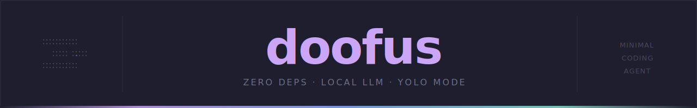

<p align="center">
  
</p>

<p align="center">
  <a href="https://github.com/erikRepo/sns-manifesto"></a>
  <a href="https://github.com/erikRepo/sns-manifesto"></a>
  <a href="https://github.com/erikRepo/sns-manifesto"></a>
  <a href="https://github.com/erikRepo/sns-manifesto"></a>
  <a href="LICENSE"></a>
  <a href="https://github.com/erikRepo/sns-manifesto"></a>
</p>

---

> A coding agent so simple, even a doofus can audit it.

A minimal local coding agent that talks to [Ollama](https://ollama.com) over a
plain TCP connection. No cloud. No telemetry. No dependencies. Just you, a
local model, and a codebase small enough to read in one sitting.

---

## ⚠️ YOLO Mode

doofus runs in full YOLO mode. The model can read files, write files, and
execute bash commands on your machine — without confirmation. There are no
safety rails, no sandboxing, and no undo.

**Run it in a container if you're not feeling brave.** A ready-made
`docker-compose.yml` is included.

---

## Why another coding agent?

Honestly? Because I couldn't audit the ones I loved.

I use Pi, I've tried the others — they're great. But at some point I wanted to
know exactly what was running on my machine, talking to my files, executing
commands in my shell. Not at a high level. Line by line.

Most agents are too large for that. Not because they're bad — because they're
built for everyone, with every feature, for every use case. That's a reasonable
choice. It just wasn't the choice I needed.

doofus is the other choice. Small enough that you can read the whole thing over
a coffee. Simple enough that you can fork it, strip it down further, or just
run it with confidence because you've seen every line it will ever execute.

No magic. No surprises. Just a few hundred lines of Rust and an honest
`docker-compose.yml`.

---

## What it does

`doofus` gives you a conversational coding agent in your terminal. It maintains
conversation context across turns and runs with a configurable set of system
prompts that define what tools the model can use: READ, WRITE, and BASH.

On startup, `fzf` opens a prompt selection menu — all prompts selected by
default. Deselect any you don't want for the session. Reasoning mode is on by
default. The model thinks before it acts.

Everything runs locally through Ollama. Nothing leaves your machine.

---

## Requirements

- [Ollama](https://ollama.com) running on `localhost:11434`
- A pulled model — see [Model setup](#model-setup) below
- [fzf](https://github.com/junegunn/fzf) for prompt selection
- Rust toolchain (to build from source)

Or just use Docker — see [Docker](#docker) below.

---

## Install

```bash
git clone https://github.com/erikRepo/doofus-cli.git
cd doofus-cli
cargo build --release
cp target/release/doofus ~/.local/bin/
```

---

## Configuration

Set these once in your shell profile and never think about them again:

```bash
# ~/.bashrc or ~/.zshrc
export DOOFUS_MODEL=qwen2.5-coder-32k
export DOOFUS_HOST=localhost:11434
```

Command line flags override environment variables when needed:

```bash
doofus --model llama3.1 "quick question"
```

Priority order: CLI flag → environment variable → built-in default.

| Variable | Flag | Default | Description |
|----------|------|---------|-------------|
| `DOOFUS_MODEL` | `--model` | `llama3` | Ollama model to use |
| `DOOFUS_HOST` | `--host` | `localhost:11434` | Ollama host and port |
| — | `--skill` | — | Path to a SKILL.md file to load as context |
| — | `--all` | — | Skip fzf, load all prompts automatically |
| — | `--no-think` | — | Disable reasoning mode |

---

## Usage

```bash
# Start a session — fzf opens to select prompts, reasoning on by default
doofus "refactor this function to be more readable"

# Pass a file as context
doofus main.rs "explain what this does"

# Skip fzf — load all prompts automatically
doofus --all "create a new module"

# Disable reasoning — model answers directly without thinking
doofus --no-think "what does this line do"

# Load an SnS skill for the session
doofus --skill ~/.claude/skills/sns/write/SKILL.md "create a new SnS-compliant module"

# Override model for a single session
doofus --model llama3.1 "quick question"
```

---

## Prompts

System prompts live in `prompts/` as plain JSON files. Each file defines one
capability the model can use.

```
prompts/
  read.json    ← READ tool: read files and directories
  write.json   ← WRITE tool: create and edit files
  bash.json    ← BASH tool: execute shell commands
```

On startup, `fzf` presents all available prompts with all selected. Deselect
any to restrict what the model can do for that session. You can add your own
prompt files — doofus picks up anything in the `prompts/` directory.

---

## Model compatibility

doofus uses the OpenAI tool call specification for passing tools to the model.
Not every Ollama model supports this — the model needs function calling support
in its response format.

**Recommended:** `qwen2.5-coder` — stable tool call support, good at following
system prompts, and fast enough for interactive use on consumer hardware.

> **Note on qwen3.5:** Although newer, `qwen3.5` currently has known tool call
> issues in Ollama — it was trained on a different XML-based format, which can
> cause tool calls to print as raw text instead of executing. Stick with
> `qwen2.5-coder` until this is resolved upstream.

Other models known to work: `llama3.1`, `mistral-nemo`. Models without tool
call support will produce unparseable responses — doofus will print the raw
output and continue.

---

## Model setup

Context length is critical for coding tasks. The default context window in
Ollama is far too small — you will run out mid-session on anything non-trivial.
Always create a model with an extended context before starting.

The easiest way:

1. Open Ollama and start a new chat with `qwen2.5-coder:7b`
2. Open model settings and increase the context window size
3. Save it as a new model, e.g. `qwen2.5-coder-32k`
4. Set it as your default:

```bash
export DOOFUS_MODEL=qwen2.5-coder-32k
```

Adjust context size based on your available VRAM:

| VRAM   | Model               | Context |
|--------|---------------------|---------|
| 8 GB   | `qwen2.5-coder:7b`  | 16384   |
| 16 GB  | `qwen2.5-coder:7b`  | 32768   |
| 24 GB+ | `qwen2.5-coder:14b` | 32768   |

Without a sufficient context window, the model will lose track of your
codebase mid-session. This is not optional — set it before you start.

---

## How it works

doofus speaks directly to Ollama's REST API over a plain `TcpStream` — no HTTP
library, no TLS, no async runtime. The entire HTTP client is ~100 lines of
standard library Rust that handles both chunked and fixed-length responses.

Tool calls are parsed from the model's response and executed locally before the
next turn. Conversation context is kept in memory for the duration of the
session.

---

## Architecture

```
doofus-cli/
  src/
    main.rs      ← entry point, argument parsing, session loop
    http.rs      ← TcpStream HTTP client, zero dependencies
    tools.rs     ← READ, WRITE, BASH tool execution
    prompt.rs    ← system prompt loading and message formatting
  prompts/
    read.json    ← READ tool definition
    write.json   ← WRITE tool definition
    bash.json    ← BASH tool definition
  assets/
    doofus-banner.svg
    doofus-footer.svg
  docker-compose.yml
  Dockerfile.ollama
  Cargo.toml
  README.md
```

Four source files. No framework. Auditable in one sitting.

---

## Docker

The fastest way to get started without touching your local machine:

```bash
docker compose up
```

This starts Ollama in a container and mounts your current directory as the
working directory for doofus. The model runs isolated — a good idea given
YOLO mode.

```yaml
# docker-compose.yml
services:
  ollama:
    image: ollama/ollama
    ports:
      - "11434:11434"
    volumes:
      - ollama_data:/root/.ollama

  doofus:
    build: .
    volumes:
      - .:/workspace
    depends_on:
      - ollama
    environment:
      - DOOFUS_MODEL=qwen2.5-coder-32k
      - DOOFUS_HOST=ollama:11434

volumes:
  ollama_data:
```

---

## SnS Compliance

doofus is the reference implementation of the [SnS manifesto](https://github.com/erikRepo/sns-manifesto/blob/main/README.md).

| Criterion | Status |
|-----------|--------|
| Binary size | < 5 MB |
| Runtime dependencies | Zero |
| Language | English |
| Source files | Four — readable in one sitting |

---

## License

MIT


